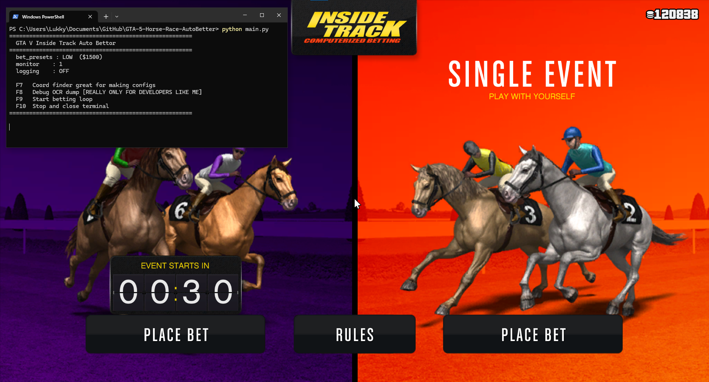

# GTA-5-Horse-Race-AutoBetter

This script works both on GTA Legacy and Enhanced during development it was tested soley on Enhanced because I haven't been able to find anything like this that actually works on Enhanced
So this script I would say is the better of both works type script it's not limited to one version of the game but works on both and is very very heavily configurable

This video basically shows what you need to edit in your config specifically
https://www.youtube.com/watch?v=yNOm-2pjr-I

Press F9 To start the script, press F10 to stop

edit config.json to modify everything about the betting

Settings your cordinates right in your config so this works on your machine
In game press F7 to get the cords for a specific button then you will see an output like this

[coords] Absolute: (-789,388)   Monitor-relative: (-789,388)
[coords] → increase_button_x/y  use: -789, 388
[coords] → bet_amount_region     hover corners, compute [x1,y1,w,h]

Copy the use x and y into the config area for whichever button your trying to set cords for
"bet_amount_x": 1319,
"bet_amount_y": 518,

This is purely example

Everything you need to edit is
  "increase_button_x": 1510,
  "increase_button_y": 508,
  "bet_amount_x": 1321,
  "bet_amount_y": 511,
  "bet_amount_crop_width": 100,
  "bet_amount_crop_height": 25,
  "place_button_x": 3203,
  "place_button_y": 733,

You need to do F7 on each of these buttons and get their cords and put them in the conf

Dependency:
https://github.com/tesseract-ocr/tesseract/releases/tag/5.5.3